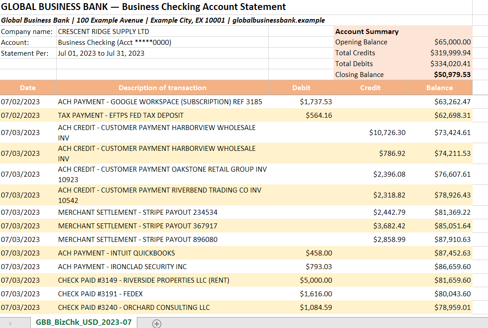
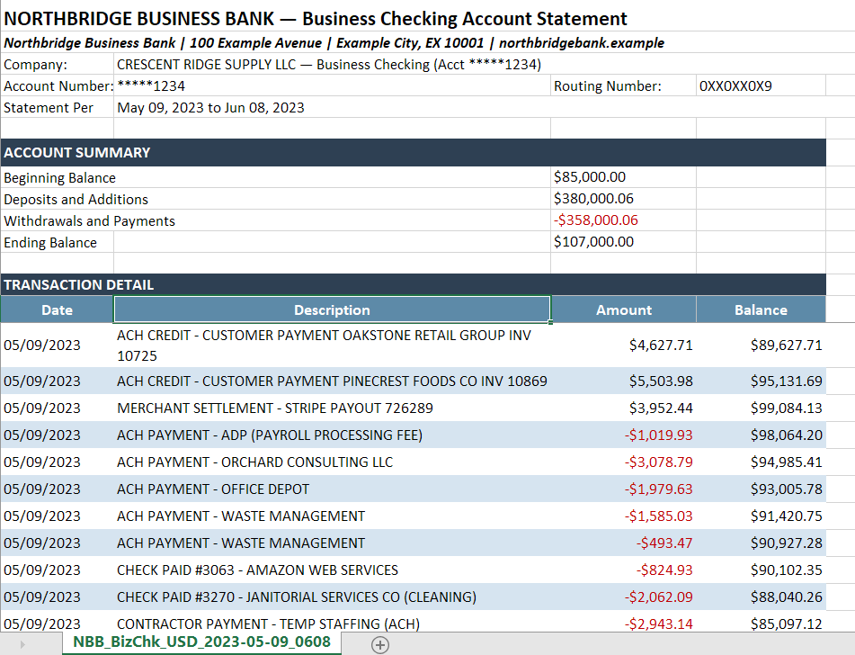
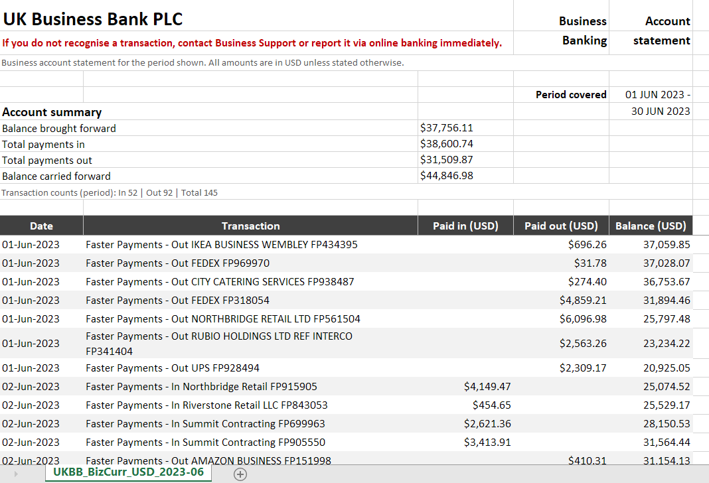
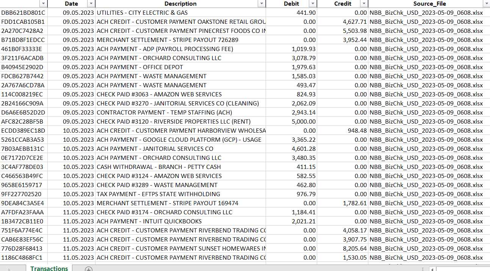

# Multibank transaction review

Python script that merges bank statement files from multiple banks into one flat Excel table.

Bank statements come in different layouts - some use separate Debit and Credit columns, others a single signed Amount. Without a script, each file has to be adjusted manually before the analysis starts. This script does that normalisation and produces one flat table for the next step.

This script comes from real work: when I review a company's cash flows, I usually receive statements from several banks, each with its own export format. The sample files in this repository use synthetic data; real counterparties and amounts were replaced for confidentiality.

---

## Table of contents
- [Overview](#overview)
- [Who this is for](#who-this-is-for)
- [Quick start](#quick-start)
- [Key features](#key-features)
- [How it works](#how-it-works)
- [Design decisions](#design-decisions)
- [Project structure](#project-structure)
- [Getting started](#getting-started)
- [Input data requirements](#input-data-requirements)
- [Supported formats](#supported-formats)
- [Demo: input → output](#demo-input--output)
- [License](#license)
- [Contact](#contact)

---

## Overview

### Scope
- **Input:** `.xlsx` statement files from multiple banks, placed in the `input/` folder.
- **Output:** `merged_statements.xlsx` - one sheet, six columns: `txn_id`, `Date`, `Description`, `Debit`, `Credit`, `Source_File`.

**Tech stack.** Python · pandas · openpyxl

**Audience.** Financial analysts and anyone who regularly works with transaction data from multiple banks.

---

## Who this is for

I built this for my own work. When reviewing a company's cash flows, I collect statements from several bank accounts and usually receive a different export layout from each bank. The script consolidates them in one run and produces a flat table for counterparty normalisation, Power BI, or further review in Excel.

Useful when:
- Analysing cash flows across multiple accounts
- Reviewing transaction data from several banks together
- Preparing data for Power BI, Power Query, or pandas

---

## Quick start

```bash
# 1. Clone the repo
git clone https://github.com/IrinaTok11/multibank-transaction-review.git
cd multibank-transaction-review

# 2. Create and activate a virtual environment
python -m venv .venv
# Windows:
.venv\Scripts\activate
# macOS/Linux:
source .venv/bin/activate

# 3. Install dependencies
pip install -r requirements.txt

# 4. Place statement files in the input/ folder, then run
python merge_statements.py
```

Result: `merged_statements.xlsx` appears in the project root with all transactions merged and sorted by date.

---

## Key features

- Header row is detected automatically - the script scans the first 30 rows and finds the one that best matches the known column names. Real bank statements often have 8-22 rows of letterhead before the transactions start.
- Format is identified by column name matching - no need to specify which bank or format each file belongs to.
- Single signed `Amount` column (positive = credit, negative = debit) is split into `Debit` / `Credit` automatically.
- Date formats: `MM/DD/YYYY`, `DD.MM.YYYY`, `DD-Mon-YYYY` (e.g. `01-Jun-2023`), plus a pandas `dayfirst=True` fallback for other common patterns - parsed in sequence. All dates are written to the output in a single consistent format (`DD/MM/YYYY`), regardless of the source bank. Excel stores dates as numbers internally, so the display format is set explicitly per cell - every user sees the same result, independent of their regional Windows settings.
- Currency symbols, thousand separators, and sign handling in amounts - `$1,234.56`, `€1.234,56`, `-$1,234.56`, `(1,234.56)`, `50 000,00` all parse correctly.
- Empty `Debit` / `Credit` cells are filled with `0.00` - no blanks in the output.
- Each row gets a `txn_id` - MD5 hash of date, amounts, description, and row index. Reproducible across runs on the same input.
- Adding support for a new statement format is usually one dictionary entry in `BANK_COLUMN_MAPS`. The current `SignedAmount` split is already built into the script.

---

## How it works

```
input/
  ├─ statement_bank_A.xlsx    ← US layout: Debit / Credit columns
  ├─ statement_bank_B.xlsx    ← US layout: single signed Amount
  └─ statement_bank_C.xlsx    ← UK layout: Paid in / Paid out
         │
         ▼
   merge_statements.py
         │
   For each file:
   1. Scan first 30 rows → find header row
   2. Load with correct header
   3. Match columns → identify format
   4. Rename to canonical schema
   5. Normalize dates and amounts
   6. Split signed Amount if needed
   7. Drop zero-amount rows (balance lines, summary rows)
   8. Tag with detected format name + source filename
         │
         ▼
   Concatenate → sort by Date → generate txn_id
         │
         ▼
merged_statements.xlsx  (one sheet: txn_id | Date | Description | Debit | Credit | Source_File)
```

**Where this fits in the analysis workflow**

```
Bank statements (various formats)
        ↓  merge_statements.py
merged_statements.xlsx - all transactions in one flat table
        ↓  counterparty normalisation (Python / SQL)
        ↓  Power BI - pivot analysis, cash flow review
```

Console output example (3 of the 6 supported formats shown):
```
  Loading statement_bank_A.xlsx ...
        header row: 8
  OK  statement_bank_A.xlsx  (34 rows, format=DebitCredit)
  Loading statement_bank_B.xlsx ...
        header row: 14
  OK  statement_bank_B.xlsx  (35 rows, format=SignedAmount)
  Loading statement_bank_C.xlsx ...
        header row: 22
  OK  statement_bank_C.xlsx  (30 rows, format=PaidInOut)
```

---

## Design decisions

- **Header detection by scoring.** The script scans each row and counts how many cells match known column names from `BANK_COLUMN_MAPS`. The row with the highest score is treated as the header. If two rows tie, the earlier one is used. A minimum score of 1 is enough to catch partial layouts and still skip most letterhead rows.

- **Column map as a config dictionary.** Format-specific logic is kept in `BANK_COLUMN_MAPS` at the top of the file. Format identification uses a 40% column-name match threshold, tolerates spacing and capitalisation differences, and also requires a date column plus at least one amount column (`debit`, `credit`, or signed `amount`). This avoids false positives where only part of the layout matches.

- **Canonical `amount` triggers automatic splitting.** When the detected format is `SignedAmount`, `split_signed_amount()` moves negative values to `Debit` and positive values to `Credit`. After that, the main pipeline works only with `debit` and `credit`.

- **Consistent date display across machines.** Excel stores dates as serial numbers, and the visible format depends on each cell's `number_format`, not on Windows regional settings. The script sets `number_format = "DD/MM/YYYY"` for every date cell in the output so the file opens with the same display across machines.


### Date handling

**What happens inside**
- `normalize_date_column()` parses the input date column using several common patterns (US `MM/DD/YYYY`, EU `DD.MM.YYYY`, UK `DD-Mon-YYYY`, and pandas fallbacks) and converts the result to one `datetime` dtype.
- After that, the original text format no longer matters - the pipeline works with datetime values.

**What you see in Excel**
- Excel stores dates as serial numbers and displays them according to each cell’s format.
- The script explicitly sets `number_format = "DD/MM/YYYY"` for every cell in the `Date` column when writing the output, so the file opens with the same `DD/MM/YYYY` display across machines.
- **Amounts stored as floats, not strings.** All `Debit` / `Credit` values land in Excel as numbers with `#,##0.00` format. DAX measures and Power Query steps can aggregate them directly.

- **Zero-fill instead of blanks.** `NaN` in amount columns can lead to issues in pivot tables and DAX. Filling with `0.00` is a safer default for financial data.

- **Six columns in output.** The pipeline uses a `fmt` column internally for logging, but it is dropped before writing. The output is always: `txn_id`, `Date`, `Description`, `Debit`, `Credit`, `Source_File`.

- **Overwrite behaviour on Windows.** `merged_statements.xlsx` is overwritten on each run if the file is closed. If it is open in Excel, Windows raises a `PermissionError` - close the file first.

---

## Project structure

```
multibank-transaction-review/
├─ input/                              # place statement files here (not tracked)
├─ docs/
│  └─ assets/
│     ├─ global_input.png              # screenshot: DebitCredit format
│     ├─ northbridge_input.png         # screenshot: SignedAmount format
│     ├─ uk_input.png                  # screenshot: PaidInOut format
│     └─ merged_statements.png         # screenshot: merged output
├─ merge_statements.py                 # main script
├─ merged_statements.xlsx              # example output (generated)
├─ requirements.txt
├─ .gitignore
├─ LICENSE
└─ README.md
```

---

## Getting started

1. **Create and activate a virtual environment**
   ```bash
   python -m venv .venv
   # Windows:
   .venv\Scripts\activate
   # macOS/Linux:
   source .venv/bin/activate
   ```

2. **Install dependencies**
   ```bash
   pip install -r requirements.txt
   ```

3. **Place statement files in `input/`**
   Files must be `.xlsx` or `.xls`. The script ignores files starting with `~` (Excel temp files). If a legacy `.xls` file fails to load in your environment, convert it to `.xlsx` and re-run.

4. **Run**
   ```bash
   python merge_statements.py
   ```

5. **Check the result**
   `merged_statements.xlsx` appears in the project root.

> To use a different input folder or output path:
> ```bash
> python merge_statements.py --input C:\path\to\statements\ --output C:\path\to\result.xlsx
> ```

> Use `--strict` to abort the run if any file fails to load (default behaviour: skip the failed file and continue processing the rest):
> ```bash
> python merge_statements.py --strict
> ```

---

## Input data requirements

The script finds the header row automatically, so no fixed layout is required. Minimum expectations:

- File format: `.xlsx` or `.xls`
- Columns that match a known format mapping (see [Supported formats](#supported-formats))
- A **date** column (`date`) with dates in one of the supported formats
- A **counterparty/description** column (`counterparty` or `counterparty_debit`/`counterparty_credit`)
- At least one **amount** column - either a `Debit`/`Credit` pair or a single signed `Amount`

Rows where both `Debit` and `Credit` are zero are dropped - this removes opening-balance lines and account summary rows that survive header detection.

---

## Supported formats

The script identifies each file by matching its column names against the configured mappings. Date formats (`MM/DD/YYYY`, `DD.MM.YYYY`, `DD-Mon-YYYY`, and pandas fallback) are tried automatically for every file - they are not tied to a specific layout. Currently handles the following amount column combinations:

| Format name | Amount columns | Notes |
|---|---|---|
| `DebitCredit` | `Debit` + `Credit` | Standard US split layout |
| `DebitCredit_Extended` | `Debit` + `Credit` | Same split layout, date column named `Transaction Date` |
| `SignedAmount` | `Amount` (signed, +/−) | Single-column layout - split automatically |
| `PaidInOut` | `Paid in (USD)` + `Paid out (USD)` | UK-style layout |
| `WithdrawalDeposit` | `Withdrawals` + `Deposits` | Alternative US naming |
| `PayeePayerSplit` | `Withdrawal Amount` + `Deposit Amount` | Split counterparty: separate `Payee` (debit) and `Payer` (credit) columns - merged into one `Description` field automatically |

To add a new layout, add one entry to `BANK_COLUMN_MAPS` in `merge_statements.py`. In the usual case, no function changes are needed; the existing `SignedAmount` split is already handled separately.

---

## Demo: input → output

### Input - DebitCredit format


### Input - SignedAmount format


### Input - PaidInOut format


### Output - merged_statements.xlsx


---

## License
This project is available under the **MIT License**. See [LICENSE](LICENSE).

---

## Contact
**IRINA TOKMIANINA** - Financial/BI Analyst  
LinkedIn: [linkedin.com/in/tokmianina](https://www.linkedin.com/in/tokmianina/) · Email: <irinatokmianina@gmail.com>
